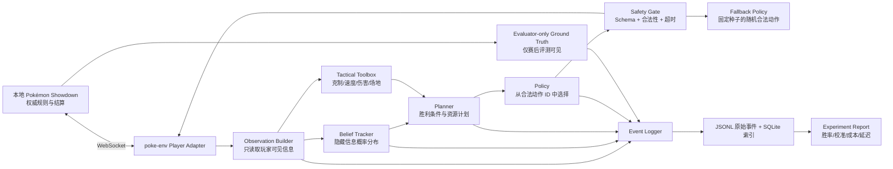

# ShowdownMind：Pokémon Showdown LLM Agent 技术设计方案

> 项目名称：**ShowdownMind**
> 版本：v0.2
> 日期：2026-07-24
> 目标平台：Apple Silicon Mac，64 GB 统一内存
> 首个实验环境：Pokémon Showdown，Gen 9 Random Battle，Singles

## 1. 执行摘要

ShowdownMind 不是一个只靠提示词“凭感觉出招”的 Bot，而是一套可重复、可消融、可扩展的 LLM Agent 研究平台。它以本地 Pokémon Showdown 服务器作为真实规则引擎，以 `poke-env` 作为 Python 接口，让不同模型、状态表示、记忆策略、信念追踪方式和搜索工具在相同条件下自动对战。

第一轮实验只解决一个清晰问题：

> 在 Gen 9 Random Battle 中，将玩家可见战局表示为结构化状态，是否比输入简化原始日志表现更好？

MVP 采用单次 Policy 调用：

```text
可见战局
  → 结构化状态
  → LLM 从合法动作中选择
  → 校验、执行、记录
```

信念追踪、确定性工具、轻量 Planner 和搜索在后续阶段逐一加入。LLM 不直接拼写 Showdown 命令，也不接触未公开的对手信息。程序负责生成合法动作、错误恢复和实验记录；LLM 只负责从当前合法集合中选择。这样可以把每个新增组件的效果单独测量。

首个可用版本的完成标准不是高胜率，而是：

- 可连续完成 100 场本地对战，无死锁、无人工干预；
- 所有决策都可追踪到状态、配置、模型版本和动作；
- 非法动作执行率为 0，模型输出失败时能以可复现的随机合法动作降级；
- 能自动比较 Random、MaxBasePower、SimpleHeuristics 和无记忆 LLM；
- 同一实验配置可重复运行并生成带置信区间的报告。

## 2. 产品定位与研究问题

### 2.1 研究目标

平台围绕六组可独立研究的问题设计：

1. **状态表示**：原始战斗日志、结构化全状态、极简摘要，哪种最适合 LLM？
2. **不完全信息**：对手招式、道具、特性、速度和太晶类型的概率信念能否改善决策？
3. **长期规划**：显式维护胜利条件、关键威胁和资源计划，是否优于每回合重新思考？
4. **工具增强**：伤害范围、速度关系、属性克制、场地伤害等确定性工具能带来多少收益？
5. **搜索与外部模拟器**：一层期望效用、两层对抗搜索和采样模拟分别是否值得成本？
6. **模型与成本**：云端强模型、本地小模型以及蒸馏后的策略模型，在胜率、延迟和成本上如何权衡？

### 2.2 首阶段范围

首阶段固定使用 `gen9randombattle`：

- 回合制，不受人类反应速度影响；
- 队伍随机，避免一开始就把项目变成组队优化；
- 对方队伍、招式、道具、特性部分隐藏，适合研究信念更新；
- 对局长度有限，便于大量自动评测；
- `poke-env` 默认格式和内置基线可直接用于起步。

### 2.3 暂不做的内容

以下内容都很有价值，但不进入 MVP：

- 自动组队和 Gen 9 OU 队伍搜索；
- Doubles/VGC 多目标动作；
- 在线天梯冲分或自动挑战真人；
- 端到端强化学习；
- ReAct 式多轮思考—工具循环；
- 通用 Agent 编排框架；
- MVP 内的 Belief Tracker、伤害工具和 Planner；
- 让模型自由执行 Python、Shell 或任意工具；
- 根据单局结果在线修改模型权重；
- 对模型输出的私有思维链进行保存或评测。

这些边界避免项目同时变成组队器、训练框架、浏览器 Bot 和通用 Agent 平台。

## 3. 三种实现路线与选择

### 路线 A：纯提示词 LLM

把战斗日志和可选动作直接交给模型，每回合返回一个动作。

优点是两三天即可跑通，适合验证连接、提示词和模型 API。缺点是状态冗长、容易遗漏持续效果、无法可靠追踪隐藏信息，也很难解释胜率变化究竟来自哪里。它应作为最早的 LLM 基线，而不是最终架构。

### 路线 B：搜索优先

调用 Showdown 模拟器，枚举我方动作、采样对方动作与隐藏队伍，再用搜索选择期望最优动作；LLM 主要生成先验或评价局势。

这条路线的上限可能更高，但复制完整战斗状态、采样合法隐藏集合、控制随机性和计算预算都很复杂。过早采用会让项目主要变成搜索工程。

### 路线 C：模块化混合 Agent（推荐）

把状态编译、信念追踪、工具计算、规划、动作选择和评测拆成独立接口。MVP 只启用状态编译和 Policy；之后依次增加信念、工具、轻量 Planner，最后再决定是否实现搜索。

推荐它的原因是每个组件都能做开关实验：

```text
LLM
+ Structured State
+ Belief Tracker
+ Deterministic Tools
+ Persistent Plan
+ Search
+ Cross-battle Memory
```

每加一层都能与上一层进行成对比较，因此适合长期研究和论文式实验。

## 4. 总体系统架构

下图是目标架构，不代表所有模块都进入 MVP。MVP 只启用 `Observation Builder → Policy → Safety Gate` 主路径。



### 4.1 三个安全边界

1. **游戏边界**：Showdown 是唯一权威规则引擎。Agent 不自己判断动作是否合法，也不自己结算回合。
2. **信息边界**：在线决策只读取玩家应当看到的状态；服务器的完整队伍、随机种子和对方未公开信息只能进入赛后评估通道。
3. **模型边界**：LLM 只能选择动作 ID 和输出有限的结构化预测，不能执行代码、发网络请求或构造底层协议命令。

### 4.2 技术栈

| 层 | 建议 |
|---|---|
| 游戏服务器 | Pokémon Showdown，本地运行，固定 Git commit |
| Agent 接口 | Python 3.12，`poke-env` 固定版本 |
| 异步执行 | Python `asyncio`，每个模型端点独立并发信号量 |
| 数据校验 | 类型化 Schema；实现时可用项目选定的 Python 校验库 |
| 原始记录 | 追加写 JSONL，不覆盖历史实验 |
| 实验索引 | SQLite，保存实验、对局、回合、决策和成本 |
| 报告 | Python 生成 Markdown、CSV 和图表 |
| 模型接入 | 自定义 `ModelClient` 协议；云端和本地服务各自实现 Adapter |
| 确定性计算 | 首先使用 `poke-env` 数据；伤害模块可接官方 `@smogon/calc` 服务 |

官方当前资料显示，`poke-env` 需要 Python 3.10 以上并推荐本地 Showdown 服务器；`Player` 可通过异步 `choose_move` 返回动作，并提供 Random、MaxBasePower、SimpleHeuristics 等基线。Showdown 当前服务器包声明 Node.js 16 以上，用户现有 Node.js 22 足够使用。相关依据见文末“官方资料”。

## 5. 核心组件设计

### 5.1 Showdown Server Manager

职责：

- 拉取并固定指定的 Pokémon Showdown commit；
- 只监听 `127.0.0.1`，使用 `--no-security` 进行本地实验；
- 启动前检查端口、Node.js 和配置；
- 将服务器 commit、格式 ID 和配置哈希写入实验元数据；
- 健康检查失败时拒绝启动实验；
- 正常关闭子进程，避免遗留端口。

不要把 Showdown 源码直接复制进主项目。推荐在 `.runtime/pokemon-showdown/` 保存本地 clone，并在 `config/showdown.lock` 记录 commit。这样既能升级，又不会因上游变动破坏旧实验。

### 5.2 `poke-env` Player Adapter

自定义 `ResearchPlayer(Player)`，只做四件事：

1. 接收 `Battle`；
2. 调用状态构建器生成快照与合法动作；
3. 调用 Agent Pipeline 获得 `action_id`；
4. 将 ID 映射回 `create_order(...)` 所需的 `Move` 或 `Pokemon` 对象。

Adapter 不包含提示词、不维护长期记忆、不写研究逻辑。它是上游协议变化与内部系统之间的防腐层。

每次请求用 `(battle_id, rqid)` 作为幂等键。重复请求必须返回同一已记录动作，防止断线重连或消息重放造成一回合做出两个不同决定。

### 5.3 Observation Builder

把 `poke-env` 的 `Battle` 对象转换成版本化的 `BattleSnapshot`。它必须是确定性的：同一可见状态永远生成同一规范化 JSON 和哈希。

第一版包括：

- 回合、阶段、格式；
- 我方完整队伍及当前公开状态；
- 对方已公开的宝可梦、招式、道具、特性、状态和血量范围；
- 双方当前出场宝可梦、能力等级变化；
- 天气、场地、双方场地状态；
- 太晶是否已使用、当前是否允许太晶；
- 强制换人、被困等动作约束；
- 本回合所有合法动作。

禁止将 `Battle` 对象整体序列化后交给模型，因为内部对象未来可能增加不应暴露的字段。

### 5.4 Legal Action Catalog

所有动作由程序生成稳定 ID。例如：

```json
[
  {
    "id": "move:earthquake",
    "kind": "move",
    "label": "Earthquake",
    "tera": false
  },
  {
    "id": "move:earthquake:tera",
    "kind": "move",
    "label": "Earthquake + Terastallize",
    "tera": true
  },
  {
    "id": "switch:rotomwash",
    "kind": "switch",
    "label": "Rotom-Wash"
  }
]
```

LLM 只能返回列表中已有的 `id`。动作映射只在内存中保存实际 `Move`/`Pokemon` 引用，模型看不到底层协议命令。

### 5.5 Belief Tracker

Belief Tracker 不进入 MVP，在第二轮研究中加入。MVP 只保存已经公开的事实，不推测隐藏招式、道具、特性或太晶类型。

Belief Tracker 维护的不是一段自由文本，而是结构化概率状态：

```json
{
  "opponent_slot_2": {
    "species": "Gholdengo",
    "moves": {
      "makeitrain": 0.81,
      "shadowball": 0.77,
      "recover": 0.34
    },
    "items": {
      "choicescarf": 0.42,
      "airballoon": 0.26
    },
    "abilities": {
      "goodasgold": 1.0
    },
    "speed_relation": {
      "faster_than_our_active": 0.64
    },
    "evidence": [
      "turn_4: revealed shadowball",
      "turn_7: moved before our active"
    ]
  }
}
```

更新分两层：

- **规则层**：已公开信息概率设为 1；互斥假设归零；根据出手顺序、伤害范围和免疫现象删除不可能项。
- **先验层**：从 Random Battle 合法集合或离线统计中提供招式、道具和特性先验。

第二轮先做规则层，不急于构建复杂统计先验。所有概率更新都应保留证据来源，以便赛后检查“为什么相信这个道具”。

### 5.6 Tactical Toolbox

Tactical Toolbox 不进入 MVP，在 Belief Tracker 之后单独加入并做消融实验。

Toolbox 只提供可验证的小工具，不提供一个会自行行动的“工具 Agent”：

- 属性克制和免疫；
- 招式基础威力、命中率和优先级；
- 双方可确定或可能的速度关系；
- 换入后的撒钉、天气、状态和剩余血量影响；
- 伤害区间及击杀概率；
- 当前动作的简单启发式评分；
- 对方可能动作集合。

每个工具结果包含输入哈希、工具版本和不确定性。如果对方道具、EV 或招式未知，输出应是区间或多个假设下的分布，不能伪装成精确值。

### 5.7 Planner 与 Policy

MVP 只实现 **Policy**。每个回合调用一次，读取当前玩家可见快照和合法动作并返回一个动作 ID，不进行 ReAct 式多轮工具调用。

MVP Policy 输出保持最小：

```json
{
  "schema_version": "1.0",
  "action_id": "switch:rotomwash",
  "confidence": 0.72,
  "reason_codes": ["AVOID_BAD_MATCHUP"],
  "short_rationale": "当前对位不利，换入抗性更好的宝可梦。"
}
```

短理由只用于审计和复盘，不能视为模型内部决策过程的可靠解释。

**Planner** 在信念和工具实验完成后加入。它是普通 Python 接口，不依赖 Agent 框架，也不负责每回合动作选择。Planner 只在开局或重大事件发生时更新：

- 宝可梦倒下；
- 关键隐藏信息公开；
- 任意一方使用太晶；
- 当前计划的失效条件被触发。

Planner 输出：

- 当前最可能的胜利条件；
- 必须保留的我方资源；
- 对方前三大威胁；
- 太晶使用计划；
- 当前计划失效的触发条件。

加入 Planner 后，Policy 每回合读取当前快照、信念、工具摘要和最新计划。Planner 与 Policy 可以使用同一模型端点，但实验上必须作为独立开关。

后期 Policy 输出可扩展为：

```json
{
  "schema_version": "1.0",
  "action_id": "switch:rotomwash",
  "confidence": 0.72,
  "opponent_action_probs": [
    {"action": "ground_attack", "probability": 0.61},
    {"action": "setup", "probability": 0.24},
    {"action": "switch", "probability": 0.15}
  ],
  "reason_codes": [
    "PRESERVE_WIN_CONDITION",
    "PREDICTED_IMMUNITY"
  ],
  "short_rationale": "保留当前宝可梦，用免疫换入覆盖最可能的地面攻击。"
}
```

不要求也不保存模型的私有思维链。

### 5.8 Safety Gate 与 Fallback

Safety Gate 按固定顺序处理：

1. 模型请求是否在截止时间内返回；
2. JSON 是否能解析；
3. Schema 是否有效；
4. `action_id` 是否属于当前合法集合；
5. 当前 `(battle_id, rqid)` 是否已执行过。

加入对手行动概率输出后，再启用概率非负与归一化校验。

失败策略：

```text
第一次失败
  → 仅发送校验错误与合法动作，允许修复一次
第二次失败或超时
  → 进入可复现的随机 Fallback
Fallback 也异常
  → 使用 poke-env 默认合法动作
```

MVP Fallback 使用由 `(experiment_seed, battle_id, rqid)` 派生的随机种子，从当前合法动作中选择。它的目的只是保证比赛继续，不应成为另一个有战斗能力的 Agent。必须提供 `FallbackOnly` 基线，并单独报告触发率；后续若改为启发式 Fallback，必须作为新的实验变量。

## 6. 数据契约

### 6.1 BattleSnapshot

```json
{
  "schema_version": "1.0",
  "battle_id": "battle-gen9randombattle-123",
  "request_id": 18,
  "turn": 9,
  "phase": "ACTION",
  "format": "gen9randombattle",
  "self": {},
  "opponent_visible": {},
  "field": {},
  "resources": {},
  "legal_actions": [],
  "snapshot_hash": "sha256:..."
}
```

### 6.2 StrategyState

```json
{
  "version": 3,
  "win_conditions": ["keep_dragapult_healthy", "remove_kingambit"],
  "preserve": ["dragapult", "greattusk"],
  "top_threats": ["kingambit", "unknown_fast_revenge_killer"],
  "tera_plan": "reserve unless it prevents a decisive KO",
  "invalidate_when": ["kingambit_faints", "opponent_reveals_choice_scarf"]
}
```

### 6.3 DecisionRecord

每次决策至少记录：

- 实验、对局、回合、请求 ID；
- 状态、信念、计划和提示词模板的哈希；
- 模型提供商、模型标识、采样参数；
- 原始结构化响应与最终执行动作；
- 校验错误、重试、Fallback 原因；
- 输入/输出 Token、估算成本；
- 端到端延迟与模型延迟；
- 对手行动预测；
- 赛后才能填入的真实对手行动和隐藏状态标签。

原始密钥、认证头和环境变量绝不写入记录。

## 7. 模型接入设计

定义稳定的内部接口：

```python
class ModelClient(Protocol):
    async def generate_structured(
        self,
        request: ModelRequest,
        response_schema: type[ResponseT],
    ) -> ModelResult[ResponseT]:
        ...
```

至少实现三种 Client：

1. `CloudModelClient`：用于强模型能力上限；
2. `LocalModelClient`：连接 Mac 上的本地 HTTP 推理服务；
3. `ReplayModelClient`：测试时从已保存响应回放，不产生费用。

模型配置不是写死在代码里，而是实验配置：

```yaml
model:
  provider: local
  endpoint: http://127.0.0.1:11434
  model_id: example-model
  temperature: 0.0
  max_output_tokens: 500
  timeout_seconds: 45
  max_retries: 1
```

云端密钥只从环境变量读取。本地和云端响应都转换成相同的 `ModelResult`，避免实验代码出现提供商分支。

在 64 GB Apple Silicon Mac 上，建议先以单个 7B–14B 量化模型做大规模实验，再根据速度和内存实测尝试更大模型。模型服务与对战进程分开，使用信号量限制并发；不要一开始同时运行多场 LLM 对局，否则延迟、内存压力和批处理行为会成为混杂变量。

## 8. 提示词设计

提示词分为不可变系统规则与可版本化任务模板。

### 8.1 系统规则

- 你在玩指定格式的 Pokémon Showdown；
- 只能基于给定的玩家可见信息；
- 只能返回 Schema 规定的 JSON；
- `action_id` 必须来自合法动作列表；
- 未知信息必须使用概率表达；
- 目标是最大化整局胜率，而不是当前回合伤害；
- 不要请求外部信息，不要输出底层命令。

### 8.2 输入顺序

```text
任务规则
→ 战略计划
→ 当前结构化战局
→ 对手信念
→ 工具计算摘要
→ 合法动作
→ 输出 Schema
```

避免每回合重复完整历史。历史信息应先被 Observation Builder 和 Belief Tracker 吸收；只有最近一至两个关键事件以摘要形式提供。

### 8.3 提示词版本

每个模板具有 `prompt_id` 和语义版本，例如 `policy.gen9rb.v1.2.0`。模板变化必须产生新版本和新哈希，不能在同一实验 ID 下静默修改。

## 9. 搜索与外部模拟器路线

搜索是可选研究方向，不是完整 Agent 的必要条件。只有 Policy、信念、工具和 Planner 分别完成消融后，才决定是否继续。若继续，按四步加入，避免一次性实现复杂树搜索。

### S0：无搜索

LLM 读取结构化状态，从合法动作中直接选择。这是所有后续实验的对照组。

### S1：一层确定性候选评分

为每个动作预计算：

- 可能伤害与击杀概率；
- 被免疫概率；
- 换人后场地伤害；
- 先后手概率；
- 是否消耗关键资源。

LLM 仍做最终选择。

### S2：一层期望效用

Belief Tracker 给出对方可能动作分布，程序计算每个我方动作对这些对方动作的期望效用。LLM 可修改先验或在接近的候选间决策。

### S3：采样隐藏状态 + 两层搜索

从信念分布采样若干完整隐藏状态，在固定预算下模拟我方动作、对方回应和下一回合。搜索不能使用真实隐藏状态；真实状态只用于赛后评估信念与采样覆盖率。

Pokémon Showdown 官方提供 Node.js 模拟 API、命令行 `simulate-battle`、带随机种子的 `generate-team` 和团队校验工具。实现 S3 时应建立独立的 Node Search Service，并固定 Showdown commit；官方明确提醒未文档化 API 不遵循稳定版本保证。

## 10. 记忆设计

记忆分三层，必须分开实验：

### 10.1 回合内工作状态

MVP 只有当前 `BattleSnapshot` 和已公开事件；`BeliefState` 与 `StrategyState` 分别在信念和 Planner 阶段加入。它们由程序维护，不依赖把完整聊天历史回灌给 LLM。

### 10.2 单局事件记忆

保存关键事件：

- 对手首次展示招式/道具/特性；
- 速度关系证据；
- 预测落空；
- 关键资源使用；
- 计划失效及重规划。

事件以结构化记录存在，不把整段聊天历史回灌给模型。

### 10.3 跨局对手记忆

只在固定队伍或重复对手实验中启用，例如记录对手的换人倾向、风险偏好和太晶时机。Gen 9 Random Battle 中队伍随机，因此跨局记忆对具体招式集合帮助有限，更适合研究“玩家风格适应”。

跨局记忆必须是显式实验变量，默认关闭，防止不同 Agent 因历史数据不同而无法公平比较。

## 11. 实验与评测设计

### 11.1 基线

最低基线集合：

- `RandomPlayer`；
- `MaxBasePowerPlayer`；
- `SimpleHeuristicsPlayer`；
- `LLM-Raw`：可见状态 + 合法动作，无信念、工具和记忆；
- `LLM-Structured`：规范化结构状态；
- `FallbackOnly`：完全不调用 LLM，只使用同一套固定种子的随机合法动作。

### 11.2 递进消融

| 编号 | 配置 |
|---|---|
| A0 | LLM + 原始简化日志 |
| A1 | A0 + 结构化状态 |
| A2 | A1 + Belief Tracker |
| A3 | A2 + Tactical Toolbox |
| A4 | A3 + Persistent Planner |
| A5 | A4 + 一层期望效用 |
| A6 | A5 + 采样搜索 |
| A7 | A6 + 跨局对手记忆 |

每次只增加一个主要变量。不要同时更换模型、提示词、状态表示和搜索预算。

### 11.3 核心指标

**对战表现**

- 胜率与 95% bootstrap 置信区间；
- Elo 或成对评分；
- 对各基线的成对胜率；
- 平均回合数、剩余宝可梦数；
- 先手席位与后手席位差异。

**决策质量**

- 对手下一动作预测的 Brier Score / Log Loss；
- 道具、招式、特性信念的校准误差；
- 太晶使用后的胜率变化；
- 明显免疫攻击、无收益招式、非必要资源浪费的比例；
- 与一层工具最优动作的分歧率。

**可靠性**

- 模型响应解析失败率；
- 非法 `action_id` 率；
- Fallback 触发率；
- 超时、断线、对局中止率；
- 重复 `rqid` 的幂等命中率。

**效率**

- 每回合与每局 Token；
- 每局估算成本；
- P50/P95 决策延迟；
- 本地模型 tokens/s；
- 单位胜率提升对应的额外成本。

### 11.4 公平性与统计协议

- 每个正式实验冻结配置、模型标识、提示词哈希和 Showdown commit；
- Agent 轮换 p1/p2；
- 使用相同的对手池和相同场数；
- LLM 温度优先设为 0，但仍记录每次响应，因为服务端可能非完全确定；
- 调试阶段每组 20–50 场，只用于发现明显问题；
- 初步结论每个 matchup 至少 200 场；
- 稳定结论或发布结果应提高到 1,000 场左右，并报告置信区间；
- 中止、超时和服务器错误单独报告，不静默删除；
- 先定义主要指标，再运行正式实验，避免从大量指标中挑最好看的结果。

Random Battle 的完全成对种子控制需要额外工程。MVP 可用大样本、换边和固定对手池降低方差；后续通过 Showdown 的带种子 `generate-team` 与自定义受控格式建立严格的 paired benchmark。

## 12. 信息泄漏防护

这是研究可信度的关键。

### 12.1 双视图

每局同时维护：

- `PlayerView`：在线 Agent 可见；
- `EvaluatorView`：服务器或实验控制器赛后可见。

两者使用不同类型和存储路径，禁止把 `EvaluatorView` 传入 Agent Pipeline。

### 12.2 自动测试

- 快照 Schema 白名单测试；
- 未公开招式、道具、特性不得出现在提示词；
- 对手完整队伍仅在 `battle_finished=true` 后写入赛后标签；
- 搜索使用的隐藏状态必须来自先验采样，并带 `sampled=true`；
- 日志扫描测试检查提示词中是否意外出现真实隐藏字段。

### 12.3 人工审计

每个正式版本随机抽取 20 场，比较提示词、玩家可见回放和赛后真值，确认没有提前泄漏。

## 13. 错误处理与恢复

| 故障 | 处理 |
|---|---|
| Showdown 未启动 | 健康检查失败，实验不开始 |
| WebSocket 断线 | 记录原因；同一对局有限次重连，否则标记 aborted |
| 模型限流/服务不可用 | 有界退避一次；随后 Fallback |
| 模型超时 | 取消请求，Fallback；不无限等待 |
| JSON 无法解析 | 返回最小校验反馈，修复一次 |
| 动作 ID 非法 | 不执行；修复一次后 Fallback |
| 重复回合请求 | 按 `(battle_id, rqid)` 返回已提交动作 |
| 数据落盘失败 | 停止启动新对局；当前对局结束后安全退出 |
| 报告生成失败 | 不影响原始 JSONL，报告可重新生成 |
| 本地模型内存不足 | 并发降为 1；仍失败则终止该实验配置 |

关键原则：模型失败不应让规则引擎失控，记录失败不应破坏原始对局，报告失败不应要求重跑实验。

## 14. 数据存储

推荐目录：

```text
data/
  raw/
    <experiment_id>/
      battles.jsonl
      decisions.jsonl
      model_calls.jsonl
      replays/
  derived/
    <experiment_id>/
      metrics.csv
      belief_calibration.csv
      report.md
  lab.sqlite3
```

JSONL 是不可变的事实来源；SQLite 用于索引和查询。派生指标可以删除后重建。

实验 ID 建议包含日期、Agent 配置短名和配置哈希：

```text
20260724-llmstructured-v1-a13f92
```

每次实验保存：

- Git commit；
- 未提交改动标记；
- Python/Node/Showdown/`poke-env` 版本；
- 操作系统与机器信息；
- 模型标识和端点类型；
- 完整配置副本；
- 提示词与 Schema 哈希；
- 起止时间与运行状态。

## 15. 项目目录

```text
showdown-mind/
  README.md
  pyproject.toml
  uv.lock
  .env.example
  config/
    agents/
      llm_raw.yaml
      llm_structured.yaml
      hybrid.yaml
    experiments/
      smoke.yaml
      baseline_tournament.yaml
    showdown.lock
  prompts/
    planner/
      gen9rb_v1.md
    policy/
      gen9rb_v1.md
  src/poke_agent_lab/
    cli.py
    config.py
    domain/
      snapshot.py
      belief.py
      strategy.py
      decision.py
    showdown/
      server_manager.py
      player_adapter.py
      action_catalog.py
    agent/
      pipeline.py
      observation.py
      belief_tracker.py
      planner.py
      policy.py
      safety_gate.py
      fallback.py
    tools/
      type_chart.py
      damage_client.py
      candidate_scorer.py
    models/
      protocol.py
      cloud.py
      local.py
      replay.py
    experiments/
      runner.py
      tournament.py
      metrics.py
      report.py
    storage/
      events.py
      database.py
  tests/
    fixtures/
    unit/
    contract/
    integration/
    leakage/
  scripts/
    setup_showdown.sh
    start_showdown.sh
  docs/
    plans/
```

模块只能按以下方向依赖：

```text
domain ← agent ← showdown adapter
domain ← tools
domain ← models
domain ← storage
experiments → agent/showdown/storage
```

`domain` 不依赖 `poke-env`、模型 SDK 或数据库，便于离线回放和单元测试。

## 16. CLI 与用户工作流

目标工作流：

```bash
# 检查本机、依赖、端口和模型端点
poke-agent doctor

# 安装或更新到锁定的 Showdown commit
poke-agent showdown setup

# 启动本地服务器
poke-agent showdown start

# 运行一场冒烟对局
poke-agent battle run --agent random --opponent random

# 运行实验
poke-agent experiment run config/experiments/baseline_tournament.yaml

# 从原始数据重建报告
poke-agent report build <experiment-id>

# 回放某次模型决策
poke-agent decision inspect <battle-id> --turn 12
```

这些是产品级命令设计，不代表当前已经实现。实际 CLI 库和参数语法应在实现阶段锁定后再写入 README。

## 17. 测试策略

### 17.1 单元测试

- `BattleSnapshot` 规范化和哈希；
- 合法动作 ID 的唯一性；
- ID 到 `BattleOrder` 的映射；
- 信念归一化、互斥假设和证据更新；
- Safety Gate 各类错误；
- Fallback 在固定状态下的确定性；
- 指标计算和费用计算。

### 17.2 契约测试

使用保存的 Showdown 消息和 `poke-env` Battle fixture：

- 上游字段变化能被及时发现；
- 玩家可见字段映射保持一致；
- 提示词 Schema 与模型响应 Schema 一致；
- 模型 Client 都满足超时、取消和结构化响应契约。

### 17.3 集成测试

- 本地 Showdown 启动与健康检查；
- Random vs Random 完整结束；
- ResearchPlayer vs 基线完整结束；
- 保存 HTML replay；
- 断开模型端点后正确 Fallback；
- 断开服务器后实验状态正确收尾；
- 10 场连续对战无残留任务。

### 17.4 泄漏测试

- 对手未公开信息不进入 `PlayerView`；
- 提示词与模型调用日志不含真值字段；
- 赛后标签只在对局结束后合并；
- 搜索样本和真实隐藏状态来源可区分。

### 17.5 长稳测试

MVP 验收时运行 100 场；研究版本发布前运行 1,000 场无人工干预测试，检查内存增长、连接泄漏、重复请求和数据完整性。

## 18. 分阶段实施计划

### M0：环境与规则基线（2–3 天）

交付：

- 初始化 Python 项目和 Git；
- 固定 Python、Node、Showdown 与 `poke-env` 版本；
- 本地 Showdown Manager；
- Random vs Random、MaxBasePower、SimpleHeuristics 可运行；
- HTML replay 和最小对局元数据。

验收：连续 20 场基线对局完成。

### M1：可靠的无记忆 LLM Agent（4–7 天）

交付：

- `BattleSnapshot` v1；
- Legal Action Catalog；
- `ModelClient`、Replay Adapter 和至少一个真实模型 Adapter；
- Policy Schema；
- Safety Gate 与 Fallback；
- 完整决策日志。

验收：连续 100 场，无非法动作执行，无人工干预。

### M2：实验与报告系统（4–7 天）

交付：

- 配置驱动的 Tournament Runner；
- JSONL + SQLite；
- 胜率、置信区间、成本、延迟、失败率；
- 自动 Markdown/CSV 报告；
- 原始日志 LLM 与结构化战局 LLM 的冻结配置。

验收：一次命令完成第一轮状态表示实验；每个主要 matchup 至少 200 场，并能从原始记录重建报告。

### M3：Belief Tracker（1–2 周）

交付：

- 规则型 Belief Tracker；
- 对手行动概率与校准指标；
- 事实与概率猜测严格分离；
- A2 消融实验。

验收：能量化对手信念对胜率和预测质量的独立影响。

### M4：确定性工具（1–2 周）

交付：

- 伤害与速度工具；
- 候选评分；
- 严格区分未知参数下的区间；
- A3 消融实验。

验收：工具结果与官方计算抽样核对，并完成成本—收益比较。

### M5：轻量 Planner（1–2 周）

交付：

- `StrategyState`；
- 事件触发重规划；
- Planner 与 Policy 独立开关；
- A4 消融实验。

验收：能量化显式战略计划对胜率、资源使用和模型成本的独立影响。

### M6：可选搜索（3–5 周）

只有前述实验表明搜索对应明确瓶颈时才进入此阶段。

交付：

- 独立 Node Search Service；
- 隐藏状态采样；
- 一层期望效用；
- 固定预算的两层搜索；
- 搜索缓存和超时；
- A5–A6 实验。

验收：搜索永不读取真值隐藏状态，并报告每步计算预算。

### M7：泛化与规模研究（持续）

- 云端/本地模型对照；
- 状态压缩与小模型蒸馏；
- 固定队伍 OU；
- 自定义未见规则；
- 重复对手与跨局记忆；
- Doubles/VGC；
- 公开 benchmark 与研究报告。

## 19. MVP 任务拆分

建议按以下顺序建立 Issue：

1. 初始化仓库、依赖锁和配置加载；
2. Showdown install/start/health/stop；
3. 三个 `poke-env` 基线和 20 场 smoke test；
4. 领域 Schema 与版本策略；
5. Observation Builder；
6. Legal Action Catalog 与订单映射；
7. Fallback Policy；
8. ModelClient 与 ReplayModelClient；
9. 首个真实模型 Adapter；
10. Prompt v1 和 Policy Response Schema；
11. Safety Gate、超时、重试和幂等；
12. JSONL Event Store；
13. SQLite 实验索引；
14. Tournament Runner；
15. 指标与 Markdown 报告；
16. 泄漏测试；
17. 100 场 MVP 验收。

前 17 项完成前，不实现长期记忆、MCTS、Web UI 或训练。

## 20. 风险与应对

### 风险 1：模型很懂宝可梦知识，但不真正规划

应对：区分动作预测、信念校准和胜率；加入 Persistent Planner 与消融，而不是只读模型解释。

### 风险 2：胜率方差掩盖改进

应对：增加场数、换边、固定对手池；后期构建带固定队伍与随机种子的受控 benchmark。

### 风险 3：上游更新破坏实验

应对：固定 Showdown commit、`poke-env` 版本和提示词；记录完整环境；所有上游交互隔离在 Adapter。

### 风险 4：工具偷偷泄漏隐藏信息

应对：Player/Evaluator 双视图、类型隔离、提示词扫描和人工抽样审计。

### 风险 5：本地模型吞吐过低

应对：先单局串行；缓存 Planner；只在事件触发时重规划；工具在模型前压缩候选；用云端模型确定能力上限。

### 风险 6：成本失控

应对：每个实验设置最大对局数、最大 Token、最大金额和最大墙钟时间；达到任一预算即停止派发新对局。

### 风险 7：项目过早膨胀

应对：MVP 只做 Singles Random Battle、无搜索、无跨局记忆。任何新模块必须对应一个明确研究假设和可测指标。

## 21. 验收标准

### MVP

- 一条命令启动本地 Showdown 并通过健康检查；
- 三个内置基线可自动对战；
- LLM Agent 只能从合法动作 ID 中选择；
- 100 场连续运行，无非法执行、无死锁；
- 所有失败均有分类并触发有限降级；
- 每场可查看 replay、状态、模型响应和最终动作；
- 自动输出胜率、置信区间、延迟、Token、成本和 Fallback 率；
- 泄漏测试通过。

### Research v1

- A0–A4 消融完成；搜索实验作为可选扩展；
- 信念预测有校准指标；
- 至少一个云端模型和两个本地模型完成同协议评测；
- 正式结论来自预先冻结的配置；
- 结果可由原始 JSONL 独立重建；
- 设计、代码、配置和实验数据拥有清晰版本对应关系。

## 22. 下一步决策

默认建议直接按以下配置进入实现：

```yaml
project: ShowdownMind
format: gen9randombattle
architecture: modular_hybrid
python: "3.12"
showdown: pinned_local_commit
model_strategy: hybrid
cloud_role: capability_ceiling
local_role: large_scale_ablation
first_agent: structured_state_no_memory
search: disabled
cross_battle_memory: disabled
```

第一轮研究问题已经确定为状态表示：比较简化原始日志与结构化玩家可见战局。随后依次加入 Belief Tracker、确定性工具和轻量 Planner；搜索保持可选。

运行架构已经确定为 Policy-first：MVP 正常情况下每回合只调用一次 Policy，不采用 ReAct 或通用 Agent 框架。Planner 在信念与工具实验完成后以事件触发方式加入。

## 23. 官方资料

- [`poke-env` 官方仓库](https://github.com/hsahovic/poke-env)：当前项目说明、Python 要求、本地服务器建议和首场对局示例。
- [`poke-env` Quickstart](https://poke-env.readthedocs.io/en/stable/examples/quickstart.html)：内置 Agent、异步对战和结果读取。
- [`poke-env` Player API](https://poke-env.readthedocs.io/en/stable/modules/player.html)：`choose_move`、`create_order`、并发参数和 `cross_evaluate`。
- [`poke-env` Battle API](https://poke-env.readthedocs.io/en/stable/modules/battle.html)：可用动作、双方队伍、场地、回合和 `last_request`。
- [Pokémon Showdown 官方仓库](https://github.com/smogon/pokemon-showdown)：服务器、模拟器和协议文档入口。
- [Pokémon Showdown 命令行文档](https://github.com/smogon/pokemon-showdown/blob/master/COMMANDLINE.md)：本地服务器、随机队伍生成、队伍验证和命令行模拟。
- [Pokémon Showdown 模拟 API](https://github.com/smogon/pokemon-showdown/blob/master/sim/README.md)：Node.js 模拟 API 与未文档化接口的稳定性警告。
- [Pokémon Showdown 自定义规则](https://github.com/smogon/pokemon-showdown/blob/master/config/CUSTOM-RULES.md)：自定义挑战、规则与私有服务器格式。
- [`@smogon/calc` 官方仓库](https://github.com/smogon/damage-calc)：程序化伤害范围计算接口。
